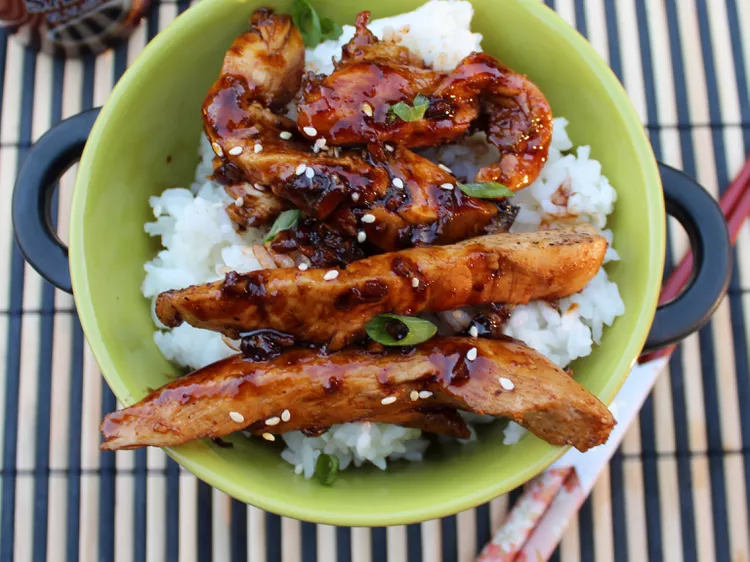

# Spicy sticky sweet chicken

## Ingredients
- chicken
  - 1 chicken breast
  - salt and pepper
- sauce
  - 1/4 cup soy sauce
  - 2 Tbsp hot sauce
  - 1 1/2 Tbsp honey
  - 1 Tbsp brown sugar
  - onion powder
- 1 1/4 cup (dry) rice

## Rice
1. put rice in rice cooker

## Sauce
1. mix all ingredients together in small bowl

## Chicken
1. cut chicken breast into long, thin pieces
2. season with salt and pepper
3. brown on medium-high heat for 1 to 2 minutes on each side
4. add sauce and simmer
5. add rice