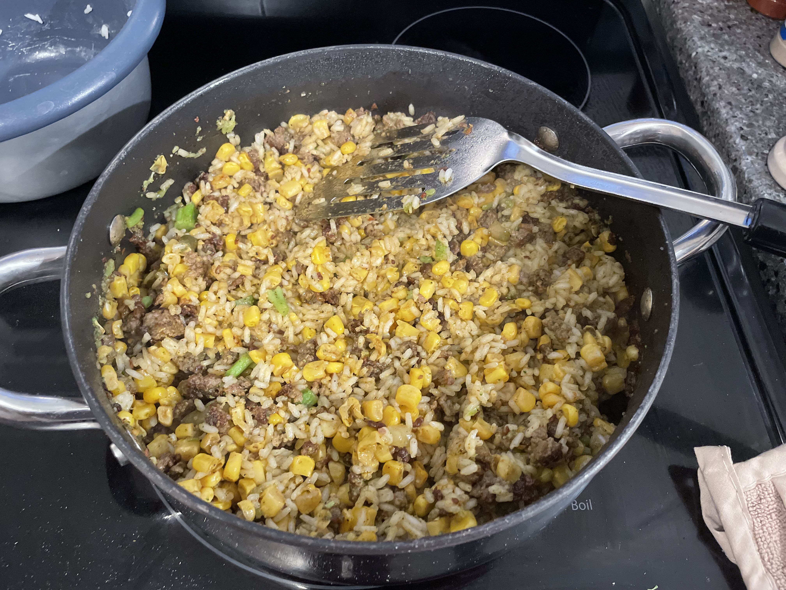

# White Man Gumbo

## Ingredients
- 1 pound hot sausage (not breakfast sausage)

- seasoning (cajun, heat, whatever really)
- 2 cans of corn
- 2 1/4 cup (dry) rice
- 1 head broccoli

optional ingredients:
- jalapeno slices, diced
- pickle chips, diced
- banana pepper rings, diced
- mushroom, sliced

## Rice
1. put rice in rice cooker

# broccoli
1. break into very small pieces
2. boil

## main pot
1. brown sausage on medium-high
2. add seasoning
3. add corn
4. add rice
5. add broccoli
6. add seasoning
7. add any other ingredients
8. add seasoning to taste